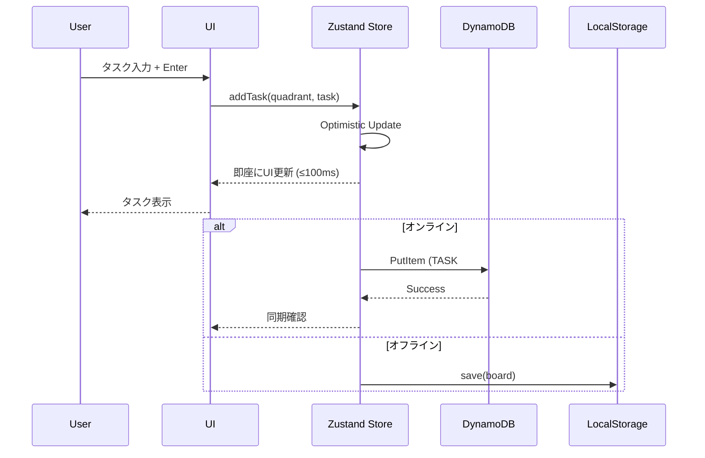
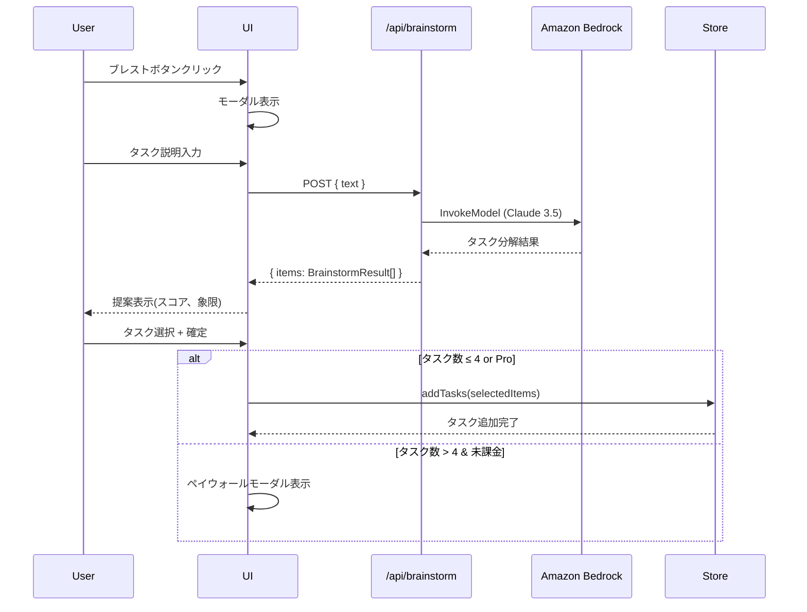
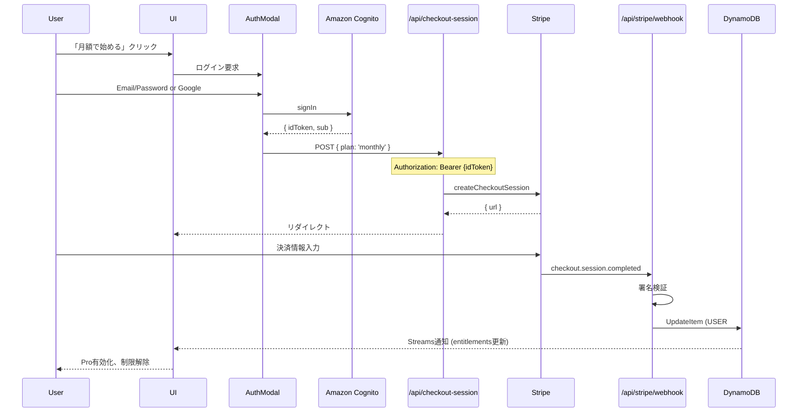
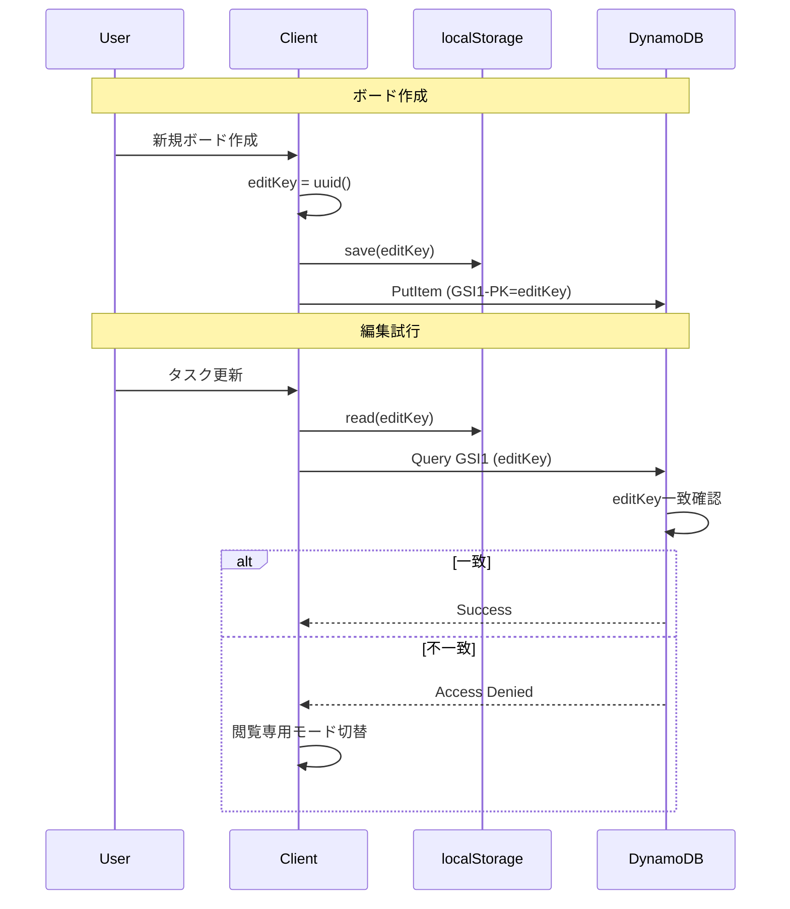

# 技術設計書 - AIsen (Eisenhower Matrix MVP) - AWS構成

## 概要

本設計書は、AIsen（アイゼンハワー・マトリクス タスク管理アプリケーション）のMVPフェーズにおける**AWS完全統合サーバーレス構成**の技術実装詳細を定義します。

### 設計アプローチ

- **AWS完全統合**: Amplify + DynamoDB + Cognito + Bedrock の完全サーバーレス構成
- **低コスト最適化**: 月額$3-8で運用可能な設計
- **リアルタイム同期**: DynamoDB Streams によるリアクティブUI
- **段階的認証**: 未ログイン→ローカル保存→Pro購入時ログイン必須
- **東京リージョン**: 全サービス ap-northeast-1 で低レイテンシ

### 要件マッピング

本設計は、[requirements.md](.kiro/specs/eisenhower-matrix-mvp/requirements.md) で定義された14の要件領域を完全にカバーします。

#### 設計コンポーネントのトレーサビリティ

| 設計コンポーネント | 対応要件 | 要件概要 |
|-------------------|---------|---------|
| **TaskCard, TaskForm, TaskEditModal** | REQ-1 | タスク管理(CRUD操作) |
| **BrainstormModal, /api/brainstorm (Bedrock)** | REQ-2 | LLMブレスト・インテーク |
| **DnDContext, useDndMonitor** | REQ-3 | ドラッグ&ドロップ操作 |
| **ShareModal, editKey認証** | REQ-4 | URL共有機能 |
| **PaywallModal, useEntitlements** | REQ-5 | 課金制限とアップグレード |
| **AuthModal, Amazon Cognito** | REQ-6 | 認証とエンタイトルメント |
| **useBoardSync, DynamoDB Streams** | REQ-7 | データ同期 |
| **/api/checkout-session, /api/stripe/webhook** | REQ-8 | 決済処理 |
| **Code Splitting, Optimistic UI** | REQ-9 | パフォーマンス |
| **Responsive Layout, Touch Sensors** | REQ-10 | モバイル対応 |
| **Keyboard Navigation, ARIA** | REQ-11 | アクセシビリティ |
| **next-intl, locale管理** | REQ-12 | 国際化 |
| **DynamoDB IAM Policy, Webhook署名検証** | REQ-13 | セキュリティ |
| **CloudWatch Logs** | REQ-14 | テレメトリ |

---

## アーキテクチャ

### システムアーキテクチャ図

```mermaid
graph TB
    subgraph Client["クライアント (Browser)"]
        UI[Next.js UI]
        Store[Zustand Store]
        LocalStorage[localStorage]
    end
    
    subgraph AWS["AWS Cloud (ap-northeast-1)"]
        subgraph Amplify["AWS Amplify"]
            Hosting[Amplify Hosting]
            Lambda[Lambda@Edge]
        end
        
        subgraph Data["データ層"]
            DDB[DynamoDB<br/>Single Table]
            Streams[DynamoDB Streams]
        end
        
        subgraph Auth["認証"]
            Cognito[Cognito<br/>User Pool]
        end
        
        subgraph AI["AI/ML"]
            Bedrock[Amazon Bedrock<br/>Claude 3.5 Sonnet]
        end
        
        subgraph Monitoring["監視"]
            CW[CloudWatch Logs]
        end
    end
    
    subgraph External["外部サービス"]
        Stripe[Stripe API]
    end
    
    UI --> Store
    Store --> LocalStorage
    UI --> Hosting
    Hosting --> Lambda
    
    Lambda --> DDB
    Lambda --> Cognito
    Lambda --> Bedrock
    Lambda --> Stripe
    Lambda --> CW
    
    DDB --> Streams
    Streams --> Lambda
    
    Stripe --> Lambda
    
    style Client fill:#e1f5ff
    style AWS fill:#ff9900,color:#fff
    style External fill:#f0e1ff
```

### 技術スタック

#### フロントエンド

| 技術 | バージョン | 用途 |
|-----|-----------|------|
| **Next.js** | 15.x (App Router) | フレームワーク、SSR/ISR |
| **React** | 19.x | UIライブラリ |
| **TypeScript** | 5.x | 型安全性 |
| **dnd-kit** | 6.x | ドラッグ&ドロップ |
| **Zustand** | 4.x | クライアント状態管理 |
| **React Query** | 5.x | サーバー状態管理 |
| **Tailwind CSS** | 3.x | スタイリング |
| **next-intl** | 3.x | 国際化 |

#### バックエンド (AWS)

| 技術 | 用途 |
|-----|------|
| **AWS Amplify Hosting** | Next.jsホスティング、SSR/ISR |
| **Lambda@Edge** | API Routes実行 |
| **DynamoDB** | NoSQLデータベース、リアルタイム同期 |
| **Cognito** | 認証 (Email/Password + Google) |
| **Bedrock** | LLM (Claude 3.5 Sonnet) |
| **CloudWatch** | ログ・監視 |
| **Stripe** | 決済処理、サブスク管理 |

#### 開発・テスト

| 技術 | 用途 |
|-----|------|
| **Vitest** | Unit Testing |
| **Playwright** | E2E Testing |
| **DynamoDB Local** | ローカル開発 |
| **Amplify CLI** | デプロイ、CI/CD |

### アーキテクチャ決定理由(ADR)

#### ADR-1: Next.js App Router 採用

**決定**: Next.js 15 の App Router を使用

**理由**:
- Server Components による初期ロード高速化
- Server Actions による型安全なAPI呼び出し
- ファイルベースルーティングの簡潔性
- Amplify との最適な統合

**トレードオフ**:
- 学習曲線(Pages Router からの移行)
- 一部ライブラリの互換性

#### ADR-2: Zustand + React Query ハイブリッド状態管理

**決定**: ローカル状態は Zustand、DynamoDB同期は React Query

**理由**:
- Zustand: 軽量(2KB)、シンプルAPI、Redux DevTools対応
- React Query: DynamoDB Streams との統合、キャッシュ管理、オフライン対応

**代替案**:
- Redux Toolkit: オーバーエンジニアリング
- Zustand のみ: DynamoDB同期の複雑化

#### ADR-3: editKey による擬似認証

**決定**: localStorage の editKey による編集権限管理

**理由**:
- 要件: 未ログインでも編集可能
- DynamoDB GSI で検証可能
- サーバーレス実装が簡潔

**制限**:
- デバイス紐付き(要件通り)
- editKey 漏洩リスク(URL に含めないことで軽減)

#### ADR-4: Stripe Checkout 方式

**決定**: Stripe Checkout (ホスト型) 採用

**理由**:
- PCI DSS コンプライアンス不要
- モバイル最適化済み
- サブスク管理機能内蔵

**代替案**:
- Stripe Elements: カスタマイズ性高いが実装複雑

#### ADR-5: AWS完全統合サーバーレス構成

**決定**: AWS Amplify + DynamoDB + Cognito + Bedrock

**理由**:
- **低コスト**: 月額$3-8 (Vercel Hobby $0, Pro $20より柔軟)
- **サーバーレス**: インフラ管理不要、自動スケール
- **AWS統合**: 単一プラットフォーム、IAM統合、監視統合
- **東京リージョン**: 低レイテンシ (Firestore Asia-northeast1 相当)
- **実験価値**: AWS学習、本格的な実装経験

**トレードオフ**:
- AWSロックイン (Firebase → AWS 移行コスト)
- 学習曲線 (Amplify CLI, DynamoDB, Cognito)
- 初期セットアップ複雑

**コスト見積もり (月間1万PV)**:
- Amplify Hosting: $1-3
- DynamoDB: $1-2 (無料枠: 25GB, 200M req/月)
- Cognito: $0-1 (無料枠: 50,000 MAU)
- Lambda: $0 (無料枠: 1M req/月)
- Bedrock (Claude): $0.50-2 (従量課金)
- **合計: $3-8/月**

---

## データフロー

### 主要ユーザーフロー

#### フロー1: タスク作成→DynamoDB同期



#### フロー2: LLMブレスト→Bedrock呼び出し



#### フロー3: Pro購入フロー (Cognito認証)



---

## コンポーネント設計

### フロントエンドコンポーネント階層

```
app/
├── layout.tsx                 # グローバルレイアウト
├── page.tsx                   # メインボードページ
├── providers.tsx              # Zustand, React Query, Amplify
├── api/
│   ├── checkout-session/
│   │   └── route.ts          # Stripe Checkout Session作成
│   ├── stripe/
│   │   └── webhook/
│   │       └── route.ts      # Stripe Webhook受信
│   └── brainstorm/
│       └── route.ts          # Bedrock LLMタスク分解
│
components/
├── Board/
│   ├── BoardCanvas.tsx       # 4象限コンテナ
│   ├── Quadrant.tsx          # 各象限
│   ├── TaskCard.tsx          # ドラッグ可能カード
│   ├── TaskForm.tsx          # タスク追加入力
│   └── TaskEditModal.tsx     # 編集モーダル
├── Brainstorm/
│   ├── BrainstormModal.tsx   # LLMブレストUI
│   └── BrainstormResult.tsx  # 提案表示
├── Share/
│   └── ShareModal.tsx        # 共有リンク生成
├── Payment/
│   ├── PaywallModal.tsx      # 課金導線
│   └── PricingCard.tsx       # プラン表示
├── Auth/
│   └── AuthModal.tsx         # Cognito ログインUI
└── Layout/
    ├── Header.tsx            # ステータス、Pro表示
    └── Toast.tsx             # 通知

stores/
├── useBoardStore.ts          # Zustand: Board状態
├── useAuthStore.ts           # Zustand: Auth状態
└── useUIStore.ts             # Zustand: モーダル状態

hooks/
├── useBoardSync.ts           # DynamoDB同期
├── useEntitlements.ts        # Pro権限購読
├── useTaskLimit.ts           # 課金制限チェック
└── useEditKey.ts             # editKey管理

lib/
├── amplify.ts                # Amplify設定
├── dynamodb.ts               # DynamoDB Client
├── cognito.ts                # Cognito Client
└── types.ts                  # TypeScript型定義
```

---

## データモデル

### TypeScript 型定義

```typescript
// Core Types
type Quadrant = 'q1' | 'q2' | 'q3' | 'q4'

interface Task {
  id: string
  title: string
  notes: string
  due: string | null  // ISO 8601
  createdAt: string   // ISO 8601
}

interface Board {
  id: string
  title: string
  editKey: string
  updatedAt: number   // Unix timestamp
  tasks: {
    q1: Task[]
    q2: Task[]
    q3: Task[]
    q4: Task[]
  }
}

interface User {
  sub: string  // Cognito User ID
  email: string
  createdAt: number
  entitlements: {
    pro: boolean
    lifetime: boolean
    proUntil: number | null
  }
}

interface Payment {
  sub: string
  type: 'monthly' | 'lifetime'
  amount: number
  currency: 'jpy'
  createdAt: number
  stripeSessionId: string
  status: 'succeeded' | 'pending' | 'failed'
}

interface BrainstormResult {
  title: string
  notes: string
  importance: number  // 0-100
  urgency: number     // 0-100
  reason: string
  quadrant: Quadrant
  suggestedDue?: string
}
```

### DynamoDB Single Table Design

**テーブル名**: `aisen-mvp`

**プライマリキー**:
- **PK** (Partition Key): String
- **SK** (Sort Key): String

**GSI (Global Secondary Index)**:
- **GSI1-PK**: editKey (editKeyからBoard検索用)
- **GSI1-SK**: METADATA

#### データ構造

| PK | SK | GSI1-PK | GSI1-SK | 属性 |
|----|----|---------|---------| ---- |
| `BOARD#{boardId}` | `METADATA` | `{editKey}` | `METADATA` | title, editKey, updatedAt |
| `BOARD#{boardId}` | `TASK#{taskId}#{quadrant}` | - | - | taskTitle, notes, due, createdAt, quadrant |
| `USER#{sub}` | `METADATA` | - | - | email, entitlements, createdAt |
| `USER#{sub}` | `PAYMENT#{paymentId}` | - | - | type, amount, stripeSessionId, status, createdAt |

#### アクセスパターン

| 操作 | キー | 説明 |
|-----|------|------|
| **Board取得** | PK=`BOARD#{boardId}`, SK begins_with `TASK#` | 全タスク取得 |
| **Board作成** | PK=`BOARD#{boardId}`, SK=`METADATA` | Board METADATA作成 |
| **Task追加** | PK=`BOARD#{boardId}`, SK=`TASK#{taskId}#{quadrant}` | Task追加 |
| **editKey検証** | GSI1-PK=`{editKey}`, GSI1-SK=`METADATA` | editKeyからBoard存在確認 |
| **User取得** | PK=`USER#{sub}`, SK=`METADATA` | User entitlements取得 |
| **Payment記録** | PK=`USER#{sub}`, SK=`PAYMENT#{paymentId}` | Payment履歴追加 |

#### DynamoDB Item 型定義

```typescript
interface DynamoDBBoardMetadata {
  PK: `BOARD#{string}`
  SK: 'METADATA'
  GSI1PK: string  // editKey
  GSI1SK: 'METADATA'
  entityType: 'BOARD'
  title: string
  editKey: string
  updatedAt: number
}

interface DynamoDBTask {
  PK: `BOARD#{string}`
  SK: `TASK#{string}#{Quadrant}`
  entityType: 'TASK'
  taskId: string
  quadrant: Quadrant
  taskTitle: string
  notes: string
  due: string | null
  createdAt: string
}

interface DynamoDBUserMetadata {
  PK: `USER#{string}`
  SK: 'METADATA'
  entityType: 'USER'
  sub: string
  email: string
  createdAt: number
  entitlements: {
    pro: boolean
    lifetime: boolean
    proUntil: number | null
  }
}

interface DynamoDBPayment {
  PK: `USER#{string}`
  SK: `PAYMENT#{string}`
  entityType: 'PAYMENT'
  paymentId: string
  sub: string
  type: 'monthly' | 'lifetime'
  amount: number
  currency: 'jpy'
  createdAt: number
  stripeSessionId: string
  status: 'succeeded' | 'pending' | 'failed'
}
```

---

## API仕様

### エンドポイント一覧

| メソッド | エンドポイント | 目的 | 認証 | ステータスコード |
|---------|--------------|------|------|----------------|
| POST | /api/checkout-session | Stripe Checkout作成 | Cognito ID Token | 200, 401, 500 |
| POST | /api/stripe/webhook | Stripe イベント受信 | Webhook Signature | 200, 400 |
| POST | /api/brainstorm | Bedrock LLMタスク分解 | Optional | 200, 400, 429, 500 |

### POST /api/checkout-session

**認証**: Cognito ID Token (Bearer)

**リクエスト**:
```typescript
{
  plan: 'monthly' | 'lifetime'
}
```

**レスポンス (200)**:
```typescript
{
  url: string  // Stripe Checkout URL
}
```

**実装詳細**:
```typescript
// app/api/checkout-session/route.ts
import { CognitoJwtVerifier } from 'aws-jwt-verify'
import Stripe from 'stripe'

const verifier = CognitoJwtVerifier.create({
  userPoolId: process.env.COGNITO_USER_POOL_ID!,
  tokenUse: 'id',
  clientId: process.env.COGNITO_CLIENT_ID!
})

const stripe = new Stripe(process.env.STRIPE_SECRET_KEY!)

export async function POST(req: Request) {
  // 1. Cognito ID Token検証
  const idToken = req.headers.get('Authorization')?.replace('Bearer ', '')
  if (!idToken) return Response.json({ error: 'Unauthorized' }, { status: 401 })
  
  const payload = await verifier.verify(idToken)
  const sub = payload.sub  // Cognito User ID
  
  // 2. プラン取得
  const { plan } = await req.json()
  
  // 3. Stripe Checkout Session作成
  const session = await stripe.checkout.sessions.create({
    mode: plan === 'monthly' ? 'subscription' : 'payment',
    payment_method_types: ['card'],
    line_items: [{
      price: plan === 'monthly' ? process.env.STRIPE_PRICE_ID_MONTHLY! : process.env.STRIPE_PRICE_ID_LIFETIME!,
      quantity: 1
    }],
    success_url: `${process.env.NEXT_PUBLIC_URL}?checkout=success`,
    cancel_url: `${process.env.NEXT_PUBLIC_URL}?checkout=cancel`,
    metadata: { sub, plan }  // Cognito User ID
  })
  
  return Response.json({ url: session.url })
}
```

### POST /api/stripe/webhook

**認証**: Stripe Webhook Signature

**リクエスト**: Stripe Event (Raw Body)

**レスポンス (200)**: `{ received: true }`

**処理イベント**:
- `checkout.session.completed`: Pro有効化
- `invoice.paid`: サブスク更新
- `customer.subscription.deleted`: Pro無効化

**実装詳細**:
```typescript
// app/api/stripe/webhook/route.ts
import Stripe from 'stripe'
import { DynamoDBClient } from '@aws-sdk/client-dynamodb'
import { DynamoDBDocumentClient, UpdateCommand, PutCommand } from '@aws-sdk/lib-dynamodb'

const stripe = new Stripe(process.env.STRIPE_SECRET_KEY!)
const client = DynamoDBDocumentClient.from(new DynamoDBClient({ region: 'ap-northeast-1' }))

export async function POST(req: Request) {
  const body = await req.text()
  const signature = req.headers.get('stripe-signature')!
  
  // 1. 署名検証
  const event = stripe.webhooks.constructEvent(
    body,
    signature,
    process.env.STRIPE_WEBHOOK_SECRET!
  )
  
  // 2. イベント処理
  switch (event.type) {
    case 'checkout.session.completed':
      const session = event.data.object as Stripe.Checkout.Session
      const { sub, plan } = session.metadata as { sub: string, plan: 'monthly' | 'lifetime' }
      
      // DynamoDB: User entitlements更新
      await client.send(new UpdateCommand({
        TableName: 'aisen-mvp',
        Key: {
          PK: `USER#${sub}`,
          SK: 'METADATA'
        },
        UpdateExpression: 'SET entitlements = :entitlements',
        ExpressionAttributeValues: {
          ':entitlements': {
            pro: true,
            lifetime: plan === 'lifetime',
            proUntil: plan === 'monthly' ? Date.now() + 30*24*60*60*1000 : null
          }
        }
      }))
      
      // DynamoDB: Payment記録
      await client.send(new PutCommand({
        TableName: 'aisen-mvp',
        Item: {
          PK: `USER#${sub}`,
          SK: `PAYMENT#${session.id}`,
          entityType: 'PAYMENT',
          paymentId: session.id,
          sub,
          type: plan,
          amount: session.amount_total!,
          currency: 'jpy',
          createdAt: Date.now(),
          stripeSessionId: session.id,
          status: 'succeeded'
        }
      }))
      break
  }
  
  return Response.json({ received: true })
}
```

### POST /api/brainstorm

**認証**: なし (レート制限のみ)

**リクエスト**:
```typescript
{
  text: string  // ユーザー入力
}
```

**レスポンス (200)**:
```typescript
{
  items: BrainstormResult[]
}
```

**実装詳細**:
```typescript
// app/api/brainstorm/route.ts
import { BedrockRuntimeClient, InvokeModelCommand } from '@aws-sdk/client-bedrock-runtime'

const client = new BedrockRuntimeClient({ region: 'ap-northeast-1' })

export async function POST(req: Request) {
  const { text } = await req.json()
  
  // Bedrock LLM呼び出し
  const prompt = `あなたはタスク優先度付けのアシスタントです。ユーザー入力から、最大5つの具体タスクに分解し、
各タスクに importance と urgency を 0-100 で付与し、その理由を短く説明してください。

importance は長期的価値・影響度、urgency は締切/外部要請/時間的圧力を指します。
推奨象限（q1:緊急×重要, q2:非緊急×重要, q3:緊急×非重要, q4:非緊急×非重要）と、
必要なら推奨期限も返してください。

ユーザー入力: ${text}

JSONで次のスキーマで返してください：
{
  "items": [
    {
      "title": "...",
      "notes": "...",
      "importance": 85,
      "urgency": 60,
      "reason": "...",
      "quadrant": "q1",
      "suggestedDue": "YYYY-MM-DD"
    }
  ]
}`

  const command = new InvokeModelCommand({
    modelId: 'anthropic.claude-3-5-sonnet-20241022-v2:0',
    body: JSON.stringify({
      anthropic_version: 'bedrock-2023-05-31',
      max_tokens: 2000,
      temperature: 0.7,
      messages: [{
        role: 'user',
        content: prompt
      }]
    })
  })
  
  const response = await client.send(command)
  const result = JSON.parse(new TextDecoder().decode(response.body))
  const items = JSON.parse(result.content[0].text)
  
  return Response.json(items)
}
```

---

## セキュリティ設計

### 認証・認可

#### Amazon Cognito User Pool設定

```typescript
// lib/cognito.ts
import { CognitoIdentityProviderClient, InitiateAuthCommand } from '@aws-sdk/client-cognito-identity-provider'

export const cognitoClient = new CognitoIdentityProviderClient({ 
  region: 'ap-northeast-1' 
})

// サインイン
export async function signIn(email: string, password: string) {
  const command = new InitiateAuthCommand({
    AuthFlow: 'USER_PASSWORD_AUTH',
    ClientId: process.env.NEXT_PUBLIC_COGNITO_CLIENT_ID!,
    AuthParameters: {
      USERNAME: email,
      PASSWORD: password
    }
  })
  
  const response = await cognitoClient.send(command)
  return {
    idToken: response.AuthenticationResult?.IdToken,
    accessToken: response.AuthenticationResult?.AccessToken,
    refreshToken: response.AuthenticationResult?.RefreshToken
  }
}
```

**Cognito User Pool 構成**:
```json
{
  "UserPoolId": "ap-northeast-1_xxxxx",
  "Policies": {
    "PasswordPolicy": {
      "MinimumLength": 8,
      "RequireUppercase": true,
      "RequireLowercase": true,
      "RequireNumbers": true,
      "RequireSymbols": true
    }
  },
  "AutoVerifiedAttributes": ["email"],
  "MfaConfiguration": "OPTIONAL",
  "EmailVerificationMessage": "認証コード: {####}",
  "EmailVerificationSubject": "AIsen 認証コード"
}
```

#### DynamoDB IAMポリシー

```json
{
  "Version": "2012-10-17",
  "Statement": [
    {
      "Sid": "AllowBoardOperations",
      "Effect": "Allow",
      "Action": [
        "dynamodb:GetItem",
        "dynamodb:PutItem",
        "dynamodb:UpdateItem",
        "dynamodb:DeleteItem",
        "dynamodb:Query"
      ],
      "Resource": "arn:aws:dynamodb:ap-northeast-1:*:table/aisen-mvp",
      "Condition": {
        "ForAllValues:StringLike": {
          "dynamodb:LeadingKeys": ["BOARD#*", "USER#*"]
        }
      }
    },
    {
      "Sid": "AllowGSIQuery",
      "Effect": "Allow",
      "Action": "dynamodb:Query",
      "Resource": "arn:aws:dynamodb:ap-northeast-1:*:table/aisen-mvp/index/GSI1"
    }
  ]
}
```

#### editKey 認証フロー



### データ保護

#### 入力バリデーション

```typescript
// lib/validation.ts
import { z } from 'zod'

export const TaskSchema = z.object({
  title: z.string().min(1).max(200),
  notes: z.string().max(2000),
  due: z.string().datetime().nullable(),
})

export const BrainstormRequestSchema = z.object({
  text: z.string().min(10).max(1000)
})
```

#### 暗号化

- **転送中**: HTTPS (TLS 1.3) - Amplify自動設定
- **保存時**: DynamoDB自動暗号化 (AES-256)
- **環境変数**: AWS Systems Manager Parameter Store

---

## パフォーマンス & スケーラビリティ

### パフォーマンス目標

| メトリック | 目標値 | 測定方法 |
|----------|-------|---------|
| **初期ロード (p95)** | < 2秒 | Lighthouse, CloudWatch RUM |
| **タスク追加→UI反映** | < 100ms | Performance API |
| **D&D フレームレート** | 60fps | Chrome DevTools |
| **Bedrock LLM レスポンス** | < 5秒 | CloudWatch Logs Insights |
| **DynamoDB 読み取り** | < 50ms | X-Ray |

### DynamoDB パフォーマンス最適化

#### Read/Write Capacity

```typescript
// Provisioned Capacity (本番)
{
  "ReadCapacityUnits": 5,   // 無料枠: 25 RCU
  "WriteCapacityUnits": 5   // 無料枠: 25 WCU
}

// Auto Scaling設定
{
  "MinCapacity": 5,
  "MaxCapacity": 100,
  "TargetUtilization": 70  // 70%でスケール
}
```

#### キャッシュ戦略

```typescript
// React Query キャッシュ
const queryClient = new QueryClient({
  defaultOptions: {
    queries: {
      staleTime: 1000 * 60 * 5,    // 5分
      cacheTime: 1000 * 60 * 30,   // 30分
      refetchOnWindowFocus: false  // フォーカス時再取得しない
    }
  }
})
```

### Amplify ビルド最適化

```yaml
# amplify.yml
version: 1
frontend:
  phases:
    preBuild:
      commands:
        - npm ci --prefer-offline
    build:
      commands:
        - npm run build
  artifacts:
    baseDirectory: .next
    files:
      - '**/*'
  cache:
    paths:
      - node_modules/**/*
      - .next/cache/**/*
      - ~/.npm/**/*
```

---

## テスト戦略

### テストカバレッジ要件

| テスト種別 | カバレッジ目標 | 対象 |
|-----------|--------------|------|
| **Unit Tests** | ≥ 80% | ビジネスロジック、ユーティリティ |
| **Integration Tests** | 100% | API Routes, DynamoDB操作 |
| **E2E Tests** | 主要フロー | クリティカルユーザージャーニー |

### DynamoDB Local テスト

```typescript
// vitest.setup.ts
import { DynamoDBClient } from '@aws-sdk/client-dynamodb'
import { DynamoDBDocumentClient } from '@aws-sdk/lib-dynamodb'

export const testDynamoDB = DynamoDBDocumentClient.from(
  new DynamoDBClient({
    endpoint: 'http://localhost:8000',  // DynamoDB Local
    region: 'ap-northeast-1',
    credentials: {
      accessKeyId: 'test',
      secretAccessKey: 'test'
    }
  })
)
```

---

## デプロイ & 環境管理

### Amplify CLI デプロイ

```bash
# 1. Amplify初期化
amplify init

# 2. ホスティング追加
amplify add hosting

# 3. Auth追加 (Cognito)
amplify add auth

# 4. API追加 (REST API)
amplify add api

# 5. デプロイ
amplify push

# 6. 本番公開
amplify publish
```

### 環境変数 (Amplify Console)

```bash
# Cognito
COGNITO_USER_POOL_ID=ap-northeast-1_xxxxx
COGNITO_CLIENT_ID=xxxxx
COGNITO_REGION=ap-northeast-1
NEXT_PUBLIC_COGNITO_USER_POOL_ID=ap-northeast-1_xxxxx
NEXT_PUBLIC_COGNITO_CLIENT_ID=xxxxx
NEXT_PUBLIC_COGNITO_REGION=ap-northeast-1

# DynamoDB
DYNAMODB_TABLE_NAME=aisen-mvp
DYNAMODB_REGION=ap-northeast-1

# Bedrock
BEDROCK_REGION=ap-northeast-1

# Stripe
STRIPE_SECRET_KEY=sk_live_xxx
STRIPE_WEBHOOK_SECRET=whsec_xxx
NEXT_PUBLIC_STRIPE_PUBLISHABLE_KEY=pk_live_xxx
STRIPE_PRICE_ID_MONTHLY=price_xxx
STRIPE_PRICE_ID_LIFETIME=price_xxx

# App
NEXT_PUBLIC_URL=https://aisen.app
```

### 環境分離

| 環境 | ブランチ | Amplify App | DynamoDB | Cognito |
|-----|---------|------------|---------|--------|
| **Development** | feature/* | ローカル | Local | Test Pool |
| **Staging** | develop | Amplify (staging) | staging-table | Test Pool |
| **Production** | main | Amplify (prod) | aisen-mvp | Prod Pool |

---

## まとめ

本設計書は、AIsen MVP の**AWS完全統合サーバーレス構成**による実装に必要な全ての技術詳細を網羅しています。

### 主要な設計決定

- ✅ **AWS Amplify Hosting**: Next.js完全サポート、低コスト
- ✅ **DynamoDB Single Table**: スケーラブル、低レイテンシ
- ✅ **Amazon Cognito**: Email/Google認証、セキュア
- ✅ **Amazon Bedrock (Claude)**: 東京リージョン、AWS統合
- ✅ **Stripe Checkout**: PCI DSS不要、簡潔実装
- ✅ **月額$3-8**: 無料枠活用、コスト最適化

### 次のステップ

1. **設計レビュー**: 本ドキュメントのレビューと承認
2. **タスク分解**: AWS構成版タスクリスト生成
3. **開発開始**: Amplify CLIセットアップから実装
4. **継続的改善**: テスト・デプロイ・フィードバックサイクル
